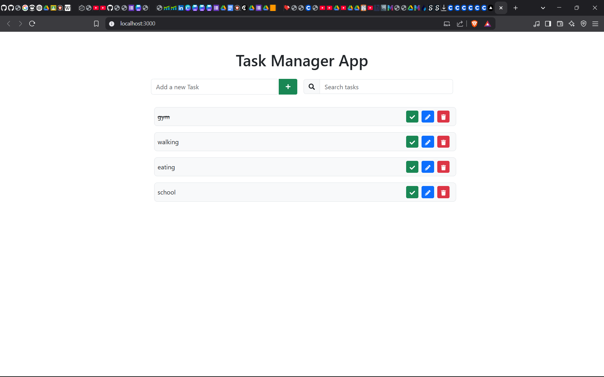
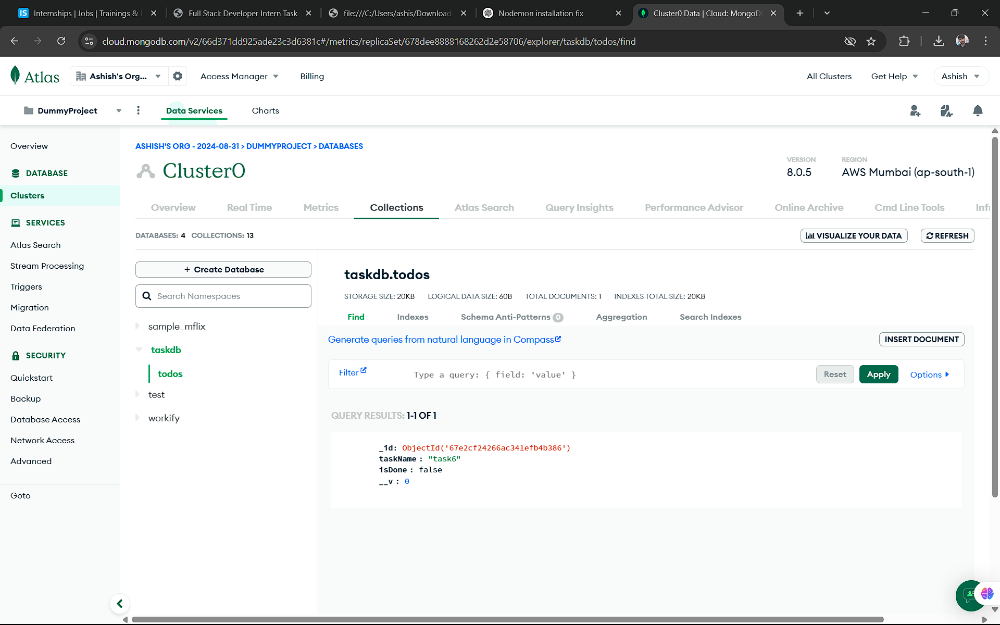

## MERN Task Management App
A full-stack MERN (MongoDB, Express.js, React, Node.js) application designed to simplify task management. It allows users to create, read, update, and delete tasks seamlessly. This project demonstrates backend API development, frontend integration, and CRUD operations with a focus on performance and scalability.

# Features
 Create, Read, Update, and Delete (CRUD) tasks.

 Persistent data storage using MongoDB.

 Fast and scalable backend with Express.js.

 Responsive UI with dynamic rendering using React.js.

 Error handling and input validation.


 ## Installation and Setup
Prerequisites
Node.js (v14 or higher)

MongoDB (Local or MongoDB Atlas)

Git


## Step 1: Clone the Repository


  git clone [<repository-url>](https://github.com/Ashish-7u/TaskManagementApp)
  

  
  cd MERN-Task-Manager-App
  


## Step 2: Install Dependencies
Backend

   cd backend
  


  npm install
 


Frontend

cd frontend
npm install


## Step 3: Set Up Environment Variables
Create a .env file in the backend directory and add your MongoDB URI and port:
DB_URL = your_mongodb_connection_string
PORT=8080


## Step 4: Run the Application
To run the backend:
 ```sh
   cd backend
   ```


 ```sh
   npm start
   ```


To run the frontend:
 ```sh
   cd frontend
   ```
    ```sh
   npm start
   ```


- Method   Endpoint        Description              Request Body
- GET      /tasks          Get all tasks            -
- POST     /tasks          Create a new task        { taskName,  isDone } 
- PUT      /tasks/:id      Update a task by ID      { taskName,  isDone } 
- DELETE   /tasks/:id      Delete a task by ID      -


## Instructions for Testing the API using Postman

1. Open Postman and create a new collection for your API.

2. Set Base URL:
 ```sh
   http://localhost:8080
   ```
  
3. Create Requests:
    1. Create a Task (POST)
       Method: POST

      URL: /tasks
     <pre>
     Body (JSON):  

 
      {
         "taskName": "task6",
        "isDone": false
      } 

     <pre>

        Expected Response:
        <pre>
        {
         "message": "Task is created",
        "success": true
       }
        <pre>
2. Get All Tasks (GET)
      Method: GET

      URL: /tasks
      Expected Response:
      <pre>
      {
         "message": "All Tasks",
           "success": true,
           "data": [
            {
           "_id": "67e2cf24266ac341efb4b386",
           "taskName": "task6",
           "isDone": false
            }
         ]
      }
      <pre>

3. Update a Task by ID (PUT)
Method: PUT

URL: /tasks/id

Replace "id" with the actual task ID.

Body (JSON):

{
  "taskName": "Updated Task",
  "isDone": true
}


Expected Response:

{
  "message": "Task Updated",
  "success": true
}


4. Delete a Task by ID (DELETE)
Method: DELETE

URL: /tasks/id

Replace "id" with the actual task ID.

Expected Response:

{
  "message": "Task is deleted",
  "success": true
}


## IMAGES




  


